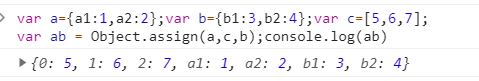
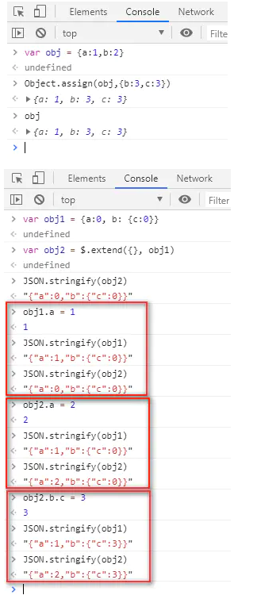
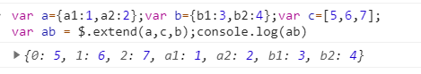
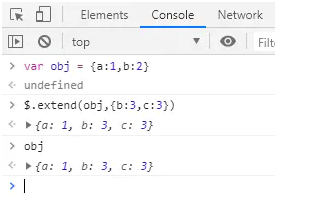
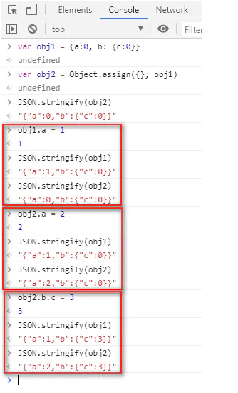

# JS Object.assign() 与 Jquery $.extend()

**都是浅拷贝**

<https://developer.mozilla.org/zh-CN/docs/Web/JavaScript/Reference/Global_Objects/Object/assign>

<https://api.jquery.com/jQuery.extend/#jQuery-extend-target-object1-objectN>

```js
var a={a1:1,a2:2};var b={b1:3,b2:4};var c=[5,6,7];
var ab = Object.assign(a,c,b);console.log(ab)
VM328:2 {0: 5, 1: 6, 2: 7, a1: 1, a2: 2, b1: 3, b2: 4}
```

```js
var a={a1:1,a2:2};var b={b1:3,b2:4};var c=[5,6,7];
var ab = $.extend(a,c,b);console.log(ab)
VM349:2 {0: 5, 1: 6, 2: 7, a1: 1, a2: 2, b1: 3, b2: 4}
```


## Object.assign() 方法






## $.extend() 方法





##  

从上面的执行结果来看，两个方法都是复制对象到目标对象。




从上面的执行结果来看，两个方法都是浅拷贝：如果属性元素为复杂杂数据类型时，内层元素拷贝引用。