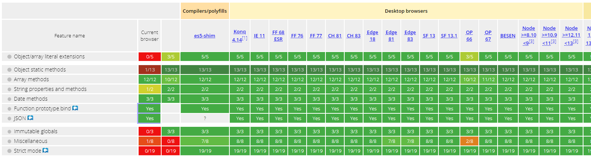

# Polyfill

Polyfill 是一块代码（通常是 Web 上的 JavaScript），用来为旧浏览器提供它没有原生支持的较新的功能。

<>

:::tip

一般自己先了解一下哪些方法某些浏览器可能不支持，然后看Specifications(规范)知道这是ECMAScript 2015语法，看Browser compatibility(浏览器兼容性)看到，使用webpack打包基本能处理ECMAScript2015成ECMAScript5，而且旧浏览器的话需要使用polyfill，然后想要处理ECMAScript2016+的话，可能就要用到babel了。

:::

https://kangax.github.io/compat-table/es5/

在babel的官方查文档，即Docs - Usage - polyfill里面，有提到了@babel/polyfill这个包，这上面提到Babel 7.4.0这个包就被弃用了

在babel的官网查看General - Caveats，里面提到了ES5和Internet Explorer，可以说使用@babel/polyfill可以兼容一些老的浏览器

**经过webpack打包的文件，基本支持大部分浏览器，IE8老了，估计要用Polyfill了**

