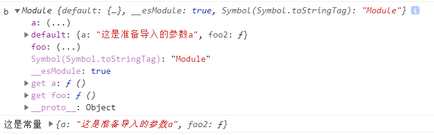

# module.exports 和 import

### 一，module.exports与exports  

   **下面测试普通环境用不了**

1. `nodeJS ` 采用 `commonJs` 规范 , 通过`exports`属性导出，通过 `require()` 引入模块
2. 通过.xx去获取值，从而了解到加载某个模块
3. `exports `是 `module.exports` 的别名

#### exports导出

```
// example.js
module.exports={
	a:'这是准备导入的参数a',
	foo:function(){
		console.log(this.a)
	},
}
//或者
exports.a = 1000;
exports.foo = function(){};
```

#### require 加载

```
let obj = require('./example.js')

//在vue-cli中引入文件是相同的功能
//import obj from '../../assets/js/export';
//let obj = require('../../assets/js/export');

console.log(obj.a,obj.foo());
```


### 二、module.export/export default{}

**主要在vue-cli框架中使用**

1. ES6中的模块功能主要由两个命令构成：`export`和`import`
2. `export`命令规定的是对外的接口，是一个对象
3. `import`命令接受一对大括号，里面指定要从其他模块导入的变量名
4. `import`命令输入的变量都是只读的，模块导出的值，只能获取，不可以修改

#### export导出

```
//example.js

export const a = '这是常量'；
export function foo(){
	console.log(a)
}
export default{
    a:'这是准备导入的参数a',
    foo2:function(){
        console.log(this)
    },
}
//export default {}
注意，一个文件只能有一个default，这代表是模块的整体输出

//或者好用的如下
let obj = {
    a:'这是准备导入的参数a',
    foo2:function(){
        console.log(this.a)
    },
}
module.exports = obj;

//{a: "这是准备导入的参数a", foo2: ƒ}
```

#### import导入

```
// 1. 常规导入
import {a,foo} from '../../assets/js/example'；//只是导出a,foo 变量方法
// 2. 别名导入
import {a as b} from ...
// 3. *导入整个模块
import * as obj from ...;//全部导出并命名obj，包含a,foo,default对象

//以上是module.export，此处是export default
import obj from ...；//只是导出 default 对象并命名obj


console.log(a,foo(),obj,obj.a,obj.foo2())
```

#### example.js文件嵌套 

```
//export与import 多个js文件相互嵌套使用
import * as b from '../../assets/js/export2';
	console.log("b",b)
export const a = b.a;
export function foo(){
    console.log(a)
}
export default{
    a:'这是准备导入的参数a',
    foo2:function(){
        console.log(a)
    },
}
```




