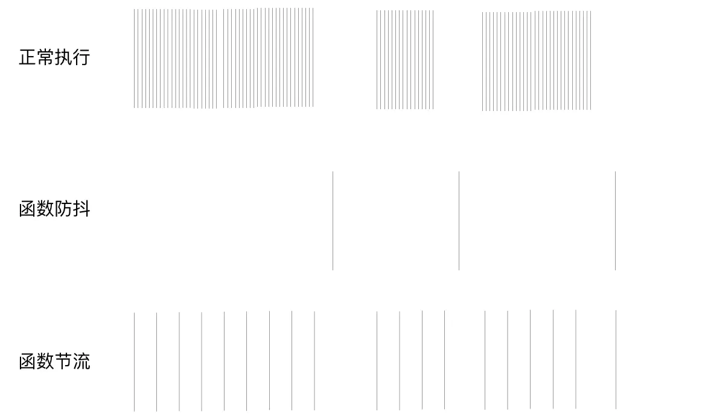

# 函数防抖和节流

> 函数的防抖和节流在我们的工作中经常会用到,在面试中也经常会出现.因此今天我们来聊聊防抖和节流

首先我们来看下面这张用竖线画成的图:



这其中的每一条竖线都代表着一次函数调用(如鼠标mousemove事件,input输入事件等) 正常执行的时候,调用的频率很快.但有时,我们并不需要这么高的频率去调用这个函数.假如这是一个调用后台接口的操作,那么就容易造成网络堵塞,大大的增加服务器的压力 函数防抖的时候,每次调用事件都是在正常执行暂停后一段时间(等你歇菜了我再上) 函数节流的时候,则是每隔一定的时间间隔就触发一次(管你频率那么快,我就保持自己的节奏) 现在我们大致明白函数的防抖和节流是怎么一回事了,接下来我们就来具体的学习下它们


## 防抖(debounce)

### 概念

在任务频繁触发的情况下,一个事件在被触发的一段时间后再执行回调,假如在这段时间内又被触发了,则重新开始计时.

### 应用场景

防抖在我们的日常生活中,也是随处可见.就比如我们平时坐电梯的时候,总是要等到没有人进来了再一小会儿的工夫,电梯门才会关上.而在项目中,防抖的应用场景也是挺多的.当我们在一个搜索框输入内容进行远程搜索的时候,往往就是在我们停下输入的一小刻时间后.前台向服务器发起了请求来获得匹配的结果.我们甚至于可以将防抖的过程,看成一个英雄在技能读条,只有技能读条结束了,技能才能扔出来.要是中途被人打断了,那么下次又要重新读条了.

### 简易版

```
<input id="ipt1" />
复制代码
```

我们先来看下没有防抖的效果:

```js
let ipt1 = document.querySelector('#ipt1')
ipt1.onkeydown = function(e){
    console.log(e.target.value)
}
复制代码
```

再来看一下加了防抖效果的代码

```js
let ipt1 = document.querySelector('#ipt1')
let timer = null
ipt1.onkeydown = function(e){
    clearTimeout(timer)
    timer = setTimeout(() => {
        console.log(e.target.value)
    },500)
}
复制代码
```

大家可以将代码copy到编辑器中运行一下看看效果,是不是加了防抖效果的用户体验会更好

### 函数版

```js
<div id="div1"></div>
复制代码
#div1 {
  height: 300px;
  background-color: orange;
  overflow: auto;
}
复制代码
let div1 = document.querySelector('#div1')
function move(e){
  this.innerText = `${e.offsetX},${e.offsetY}`
}
function debounce(fn, wait){
  let timer = null
  return function(){
    let args = arguments
    clearTimeout(timer)
    timer = setTimeout(() => {
      fn.apply(this, args)
    }, wait)
  }
}
let debounceMove = debounce(move, 500)
div1.onmousemove = debounceMove
复制代码
```

其中`debounce`就是我们的核心防抖函数了

## 节流(throttle)

### 概念

高频事件触发,但是在n秒内只会执行一次,会稀释函数的执行频率

### 应用场景

节流在生活中的实例,就比如看电影的时候,每秒有24帧.大概意思就是每一秒钟的电影,其实是给大家播放了24张连续的图片.帧数越高，电影看着就越流畅.但是当帧数达到一定的高度时,我们的肉眼已经是看不出区别了.而在项目当中的应用也较多,比如在滚动加载更多的时候,在监听滚动条位置的时候并不是用户每次滚动都要去监听滚动条的位置,而是例如在1s内不管滚动多少次,只监听一次滚动条的位置.假如将节流运用到游戏当中,那就相当于技能的CD,CD没到,你就是按坏了键盘,技能也放不出来.

### 简易版

```html
<div id="div1">
    <p>1</p>
    <p>1</p>
    ...
</div>

#div1 {
    height: 200px;
    background-color: orange;
    overflow: auto;
}

```

我们先来看下普通的效果,可以看到控制台在疯狂输出

```js
let div1 = document.querySelector('#div1')
div1.onscroll = function(e){
    console.log('我在疯狂输出')
}

```

再来看下加了节流效果的,控制台每隔一段时间才会打印一次内容

```js
let div1 = document.querySelector('#div1')
let flag = true
div1.onscroll = function(e){
    if(!flag){
        return false
    }
    flag = false
    setTimeout(() => {
        console.log('我在慢慢输出')
        flag = true
    },500)
}

```

### 函数版

#### 定时器版本

使用定时器来达到节流的效果

```js
let div1 = document.querySelector('#div1')
function move(e){
  this.innerText = `(${e.offsetX}, ${e.offsetY})`
}
function throttle(fn, wait){
  let timer = null
  return function(){
    let args = arguments
    if(!timer){
      timer = setTimeout(() => {
        timer = null
        fn.apply(this, args)
      }, wait)
    }
  }
}
let throttleMove = throttle(move, 500)
div1.onmousemove = throttleMove 

```

#### 时间戳版本

使用时间戳来达到节流的效果

```js
function throttle(fn, wait){
  let time = 0
  return function(){
    let now = Date.now()
    let args = arguments
    if(now - time > wait){
      fn.apply(this, args)
      time = now
    }
  }
}


```

这个版本的时间戳节流当我们的鼠标移出监听区域的时候,即停止运行了.

#### 定时器+时间戳版本

下面我们来个加强版本的,这个版本是结合了定时器和时间戳,在我们鼠标移出监听区域后,还会再执行一次函数

```js
function throttle(fn, wait){
  let time = 0, timer = null
  return function(){
    let now = Date.now()
    let args = arguments
    if(now - time > wait){
      fn.apply(this, args)
      time = now
    }else{
      timer && clearTimeout(timer)
      timer = setTimeout(() => {
        fn.apply(this, args)
        time = now
      }, wait)
    }
  }
}

```

> **总结:** 防抖和节流都是为了限制函数的执行频率,以优化函数触发频率过高导致的响应速度跟不上,延迟假死或卡顿的现象
>
> - 函数防抖:原理是维护一个计时器,在规定时间后执行回调.若在此期间再次触发,则重新开始计时
> - 函数节流:原理是判断是否达到规定时间