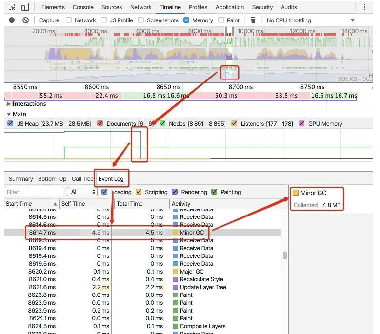
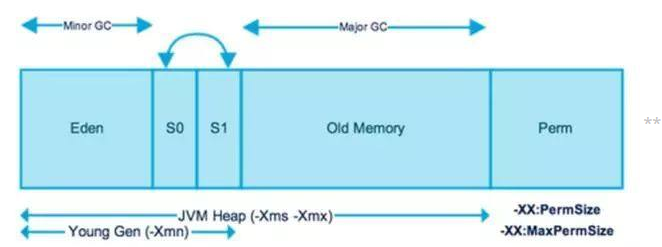

# 前端内存泄漏

**不再用到的内存，没有及时释放，就叫做内存泄漏（memory leak）。**

## **产生内存泄露的原因**

1. 使用了全局变量
2. 闭包引起的内存泄漏
3. 没有清理的DOM元素引用 （setInterval，addEventListener，$(window).on('scroll/click...')等）
4. 定时器以及其中的引用


5. vue中使用eventbus的时候没有$off,vuex中$store.watch监听后没有释放，要记得unwatch一下。
6. 使用第三方库创建的时候没有调用正确的销毁函数
7. 不断调用echart导致内存泄露

不停的用setInterval调用echart，更新echart表格及地图数据，及时清理了setInterval，也会导致内存泄露！


<https://www.cnblogs.com/lanhuo666/p/11626936.html>

<https://www.cnblogs.com/leftJS/p/11083191.html>

## 什么是内存泄漏？

> 程序的运行需要内存。只要程序提出要求，操作系统或者运行时**（runtime）**就必须供给内存。

> 对于持续运行的服务进程**（daemon）**，必须及时释放不再用到的内存。否则，内存占用越来越高，轻则影响系统性能:变慢，延迟大等 ，重则导致进程崩溃。

**不再用到的内存，没有及时释放，就叫做内存泄漏（memory leak）。**

## 内存泄漏的识别方法

1. 使用快捷键 F12 或者 Ctrl+Shift+J 打开 Chrome 浏览器的「开发者工具」。
2. 选择 Performance(老版为Timeline) 选项卡，在 Capture 选项中，只勾选 Memory。
3. 设置完成后，点击最左边的 Record 按钮，然后就可以访问网页了。
4. 打开一个网站，例如：www.taobao.com当网页加载完成后，点击 Stop，等待分析结果。
5. 然后在 Chart View 上寻找内存急速下降的部分，查看对应的 Event Log，可以从中找到GC 的日志。

具体过程如下图所示：




**JVM堆内存被分为两部分：年轻代（Young Generation）和老年代（Old Generation）。**




### 垃圾回收叫做 `Minor GC`

### 老年代的垃圾收集叫做 `Major GC`

- `Major GC `通常是跟 `full GC `是等价的，收集整个GC堆
- Full GC定义是相对明确的，就是针对整个新生代、老生代、元空间（metaspace，java8以上版本取代perm gen）的全局范围的GC。

#### 1.年轻代  Minor GC

年轻代是所有新对象产生的地方。当年轻代内存空间被用完时，就会触发垃圾回收。这个垃圾回收叫做Minor GC。年轻代被分为3个部分——Enden区和两个Survivor区。

#### 2.年老代  Major GC

年老代内存里包含了长期存活的对象和经过多次Minor GC后依然存活下来的对象。通常会在老年代内存被占满时进行垃圾回收。


## 内存泄露的常见原因及处理方式

### 常见原因：

#### 1. 意外的全局变量

> 下面代码中变量`bar`在`foo`函数内,但是`bar`并没有声明`JS`就会默认将它变为全局变量,这样在页面关闭之前都不会被释放

```js
function foo(){
  bar=2
  console.log('bar没有被声明!')
}
//函数 foo 内部忘记使用 var ，意外创建了一个全局变量,在浏览器中，全局对象是 window 
//真相是：
function foo(){
    window.bar = 2;
}
//严重的情况，另一种意外的全局变量可能由 this 创建，this指向了全局对象window
function foo(){
    this.bar = 2;
}

```

- b 没被声明,会变成一个全局变量,在页面关闭之前不会被释放.使用严格模式可以避免.
- **在 JavaScript 文件头部加上 `'use strict'`，可以避免此类错误发生。启用严格模式解析 JavaScript ，避免意外的全局变量。**

#### 2. dom清空时，还存在引用

> 很多时候,为了方便存取,经常会将 `DOM` 结点暂时存储到数据结构中.但是在不需要该`DOM`节点时,忘记解除对它的引用,则会造成内存泄露.

```js
var element = {
  shotCat: document.getElementById('shotCat')
};

document.body.removeChild(document.getElementById('shotCat'));
// 如果element没有被回收,这里移除了 shotCat 节点也是没用的,shotCat 节点依然留存在内存中.
```

- 与此类似情景还有: DOM 节点绑定了事件, 但是在移除的时候没有解除事件绑定,那么仅仅移除 DOM 节点也是没用的

#### 3. 定时器中的内存泄漏

```js
var someResource = getData();
setInterval(function() {
  var node = document.getElementById('Node');
  if(node) {
    node.innerHTML = JSON.stringify(someResource));
  }
}, 1000);
```

- 如果没有清除定时器,那么 someResource 就不会被释放,如果刚好它又占用了较大内存,就会引发性能问题. 但是 **setTimeout ,它计时结束后它的回调里面引用的对象占用的内存是可以被回收的.** 当然有些场景 setTimeout 的计时可能很长, 这样的情况下也是需要纳入考虑的.

#### 4. 不规范地使用闭包

> 相互循环引用.这是经常容易犯的错误,并且有时也**不容易**发现.

例如:

```js
function foo() { 
  var a = {}; 
  function bar() { 
    console.log(a); 
  }; 
  a.fn = bar; 
  return bar; 
};
```

- bar和a形成了相互循环引用.可能有人说bar里不使用console.log(a)不就没有引用了吗就不会造成内存泄露了.NONONO,**bar作为一个闭包,即使它内部什么都没有,foo中的所有变量都还是隐式地被 bar所引用。** **即使bar内什么都没有还是造成了循环引用**,那真正的解决办法就是,不要将a.fn = bar.

### 避免策略：

**1.**  减少不必要的全局变量，或者生命周期较长的对象，及时对无用的数据进行垃圾回收(**即赋值为null**)；
 **2.**  注意程序逻辑，避免**“死循环”**之类的 ；
 **3.**  避免创建过多的对象 原则：**不用了的东西要记得及时归还。**
 **4.**  减少层级过多的引用