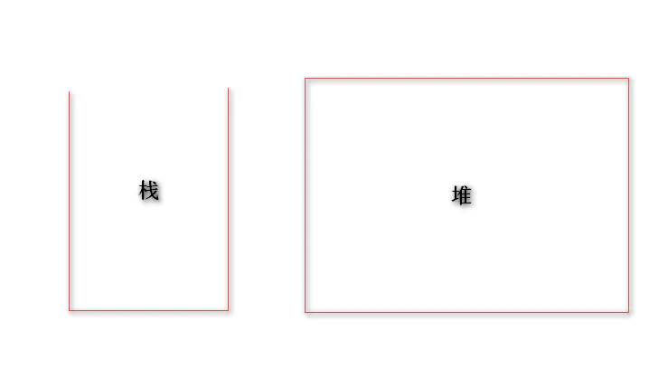

# 堆和栈

:::tip

1. 变量都是存放在**内存中**的
2. 内存给变量定义了两块区域：**堆区域**，**栈区域**
3. **栈**的特点，开口向上，速度快，容量小，存储 **基本数据类型**  String, Number, Boolean, Null , undefined
4. **堆**的特点，-------------   速度慢，容量大，存储 **引用数据类型**  Object , 包含( function  Array  Date)

:::

