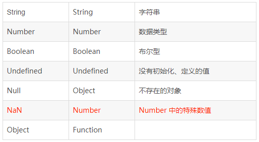
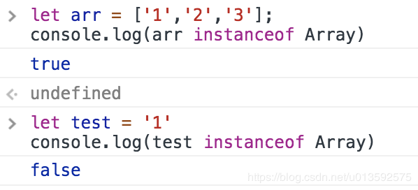
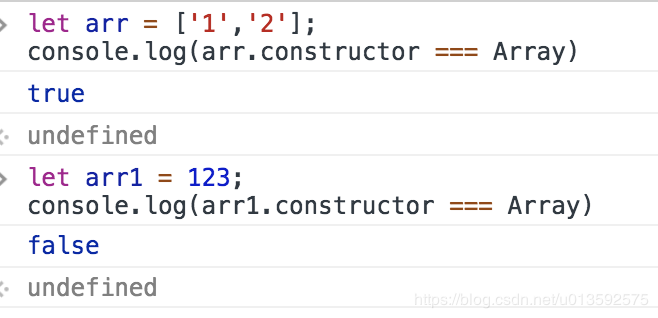
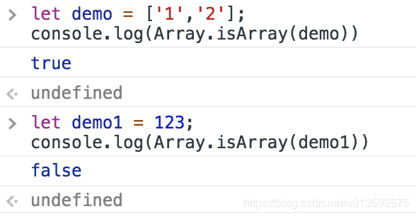
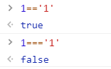

# 数据类型

## 数据类型

### 1. Number 数字类型

### 2. String  字符串类型

​		 null和undefined没有toString()方法

​		 toString()可以输出二进制、八进制、十进制，十六进制

```js
var a=1156150;
a = a.toString(2);
console.log(a)// 100011010010000110110
```

### 3. Boolean 布尔类型  true  false

### 4. Null 类型  空对象指针

### 5. undefined 类型

### 6. object 对象类型

​	object 的每个实例都有下列属性和方法：

```js
 	constructor：保存着用于创建当前对象的函数。（构造函数)constructor就是object();

    hasOwnProperty(propertyName):用于检查给定的当前属性在当前对象实例中）而不是在实例原型中）是否存在。其中，作为参数的属性名（propertyName)必须以字稚串形式指定（例如：o.hasOwnProperty(“name”))。

    isPrototypeOf(object):用于检查传入的对象是否是传入对象原型。

    propertyIsEnumerable(propertyName):用于检查给定属性是否能够用for-in语句。与hasOwnProperty（）方法一样，作为参数的属性名必须以字符串形式指定。

    toLocaleString( ):返回对象的字符串表示，该字符串与执行环境的地区对应。

    toString( ):返回对象的字符串表示。

    valueOf( ):返回对象的字符串、数值或者布尔值表示。通常与toString( )方法的返回值得相同。
```

### 7. symbol  类型

​	symbol 类型的对象永远不相等，用来标记，ES6新增类型

### 8. BigInt 类型

​	JavaScript 中的任意精度整数，安全存储和操作大整数。chrome67 新增功能

​	即始超出 Number 能够表示的安全整数范围

## 相关问题


### JS数据类型：JS 的数据类型有几种？

```js
  8种。Number、String、Boolean、Null、undefined、object、symbol、bigInt。
```


### JS数据类型：Object 中包含了哪几种类型？

```js
  其中包含了Data、function、Array等。这三种是常规用的。
```


### JS数据类型：JS的基本类型和引用类型有哪些呢？

```js
基本类型（单类型）：除Object。 String、Number、boolean、null、undefined。

引用类型：object。里面包含的 function、Array、Date。
```

### JS数据类型：JS 中 typeof 输出分别是什么？

 注意一点：NaN 是 Number 中的一种，非Number 



### JS数据类型：如何判断数据类型？

1. typeof 操作符（通用：上面有内容有讲到）

2. toString ( )   

   ​	作用：其他类型转成 string 的方法

   ​    支持：number、boolean、string、object 

   ​    不支持：null 、undefined

3. toLocaleString ( )

   ​	把数组转成本地字符串  

4. 检测数组类型的方法 

   ① instanceof  操作符

   ​          

   ​    ②对象的 constructor 属性

   ​            

   ​      ③ Array.isArray( ) 检验值是否为数组

   ​            


### JS数据类型：null 和 undefined 有什么区别？

```
Null 只有一个值，是 null。不存在的对象。

Undefined 只有一个值，是undefined。没有初始化。undefined 是从 null 中派生出来的。

简单理解就是：undefined 是没有定义的，null 是定义了但是为空。
```

### JS数据类型：null 不存在的原因是什么？如何解决？

   不存在的原因是：

```txt
            1､方法不存在

            2､对象不存在

            3､字符串变量不存在

            4､接口类型对象没初始化 

解决方法：

            做判断处理的时候，放在设定值的最前面
```

### JS数据类型：== 和 === 有什么区别，什么场景下使用？

```js
== 表示相同。值相同

        比较的是物理地址，相当于比较两个对象的 hashCode ，肯定不相等的。

        类型不同，值也可能相等。

=== 表示严格相同。类型和值都必须相同

        例：同为 null／undefined ，相等。

简单理解就是 == 就是先比较数据类型是否一样。=== 类型不同直接就是 false。
```



### JS数据类型：对象可以比较地？

​    对象是可以比较，遍历比较key 和 value就行， [Object.is(value1](http://object.is/), value2)。

