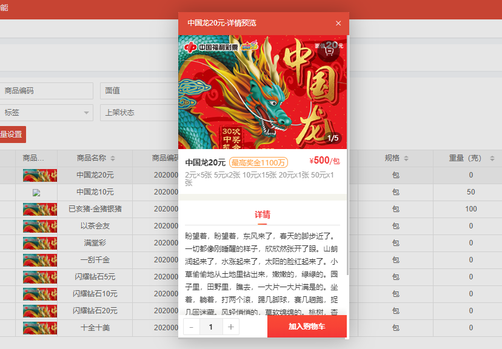

# layui.laytpl :bookmark_tabs:

**案例：商城平台商品管理系统-商品预览部分**

## 第一步：编写模版。

**你可以使用一个script标签存放模板，如：**

```html
<script id="previewTemp" type="text/html">
      <div class="layui-carousel" id="carouselList" lay-filter="carouseOn">
        <div carousel-item="">
          {{#  layui.each(d.data.itemImages, function(index, item){ }}
          <div></div>
          {{#  }); }}
        </div>
      </div>
      <!--模板嵌套模板-->
      <div id="countHtml"></div>
      <h3>{{d.data.itemName}}<span class="zg-jj">最高奖金{{parseInt(d.data.maxWin)}}万</span>
      </h3>
 
</script>
```

```html
<script id="countTemp" type="text/html">
  <div class="hd-count"><span class="nub">{{d.currentIndex}}</span>/<span class="cou">{{d.count}}</span></div>
</script>
```

## 第二步：建立视图

**用于呈现渲染结果**

```html
@layout("/common/_container.html",{js:["/assets/goods/itemList/preview/common.js","/assets/goods/itemList/preview/itemList_preview.js"],css:["/assets/goods/itemList/preview/common.css","/assets/goods/itemList/preview/itemList_preview.css"]}){
	<div id="previewHtml"></div>
@}

//layout 是导入方法，别的文章分析
```

## 第三步：渲染模版

**嵌入模板原因：这部分代码是动态的，在轮播里需要重新渲染，重新执行**laytpl(countTemp.innerHTML).render()}

```js
layui.use([ 'laytpl','carousel','admin', 'ax'], function () {
  var $ = layui.jquery;
  var laytpl = layui.laytpl;
  var carousel = layui.carousel;
  var $ax = layui.ax;

  /*模板渲染*/
  var ItemListPreviewData = {
    currentIndex:1,
    count:1,
    data:{},
  }
  var ajax = new $ax(Feng.ctxPath + "/itemList/previewItem", function (data) {
    ItemListPreviewData.data = data.data[0];
    ItemListPreviewData.count = data.data[0].itemImages.length;
  });
  ajax.set("itemId", Feng.getUrlParam("itemId"));
  ajax.start();

  //模板渲染
  var previewHtml = document.getElementById('previewHtml');
  laytpl(previewTemp.innerHTML).render(ItemListPreviewData, function(html){
    previewHtml.innerHTML = html;
  });

  //模板中嵌入的模板渲染
  var countHtml = document.getElementById('countHtml');
  laytpl(countTemp.innerHTML).render(ItemListPreviewData, function(html){
    countHtml.innerHTML = html;
  });

  //图片轮播
  carousel.render({
    elem: '#carouselList',
    width:'375px',
    height:'250px',
    interval:3000,
    arrow:'hover',
    indicator:'none',
  });
  carousel.on('change(carouseOn)', function(res){
    ItemListPreviewData.currentIndex = res.index+1;
    laytpl(countTemp.innerHTML).render(ItemListPreviewData, function(html){
      countHtml.innerHTML = html;
    });
  });
});
```

## 最后：页面效果

**动态渲染部分是，轮播右下角变化角标**

