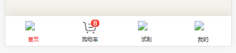

# 图片相对路径转base64

**vue中data中定义图片相对路径页面不显示问题**

vue在data中定义图片相对路径：

```js
data() {
  return {
    footBoxlist:[
      {text:"首页",count:"",show:true,src:"../../src/assets/img/index/f-home-h.png",link:"/"},
      {text:"购物车",count:"",show:false,src:require("@/assets/img/index/f-cart-m.png"),link:"/view/cart.html"},
      {text:"试刮",count:"",show:false,src:"@/assets/img/index/f-sg-m.png",link:"http://ggl.zhcw.com/h5/ggl/"},
      {text:"我的",count:"",show:false,src:"@/assets/img/index/f-my-m.png",link:"/view/personal.html"}
    ],
  }
},
```



解决办法：

1：使用绝对路径，域名形式：https://

2：使用require：

```js
data() {
    return {
      active: 1,
      icon: {
        active: require("../assets/images/home-selected.png"),
        inactive: require("../assets/images/home.png")
      }
    };
  }
```

